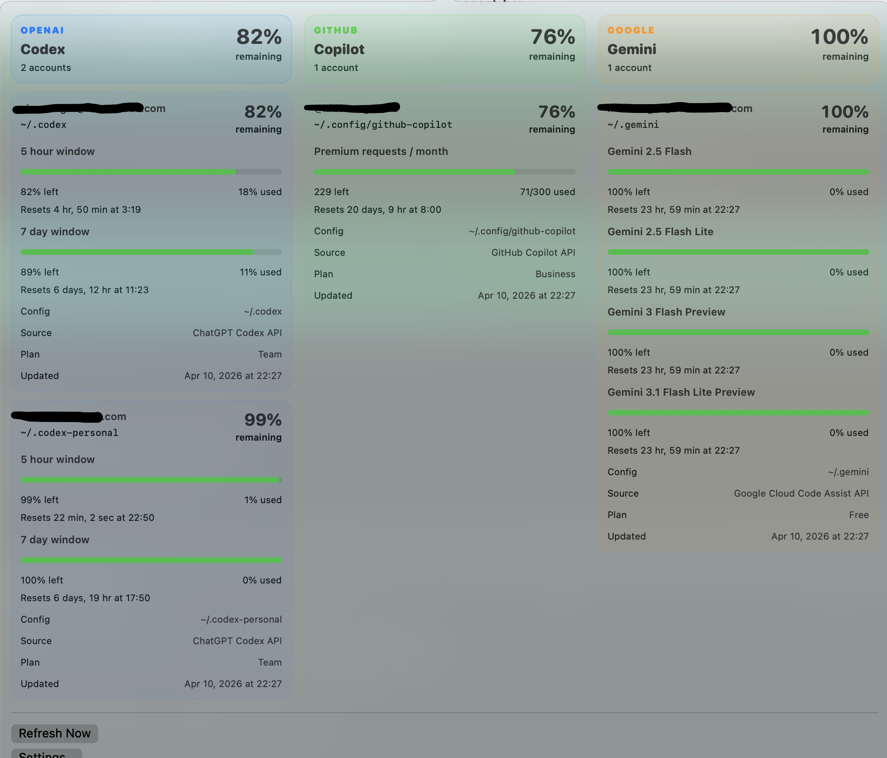

# AgentBar

Minimal macOS menu bar app for tracking local coding-agent usage and account status, with a desktop widget for quick at-a-glance viewing.

> This app was generated entirely by coding agents.

AgentBar detects supported providers automatically from local CLI or IDE login files and displays them side by side in the menu bar popover. Providers without local credentials stay hidden.

## Desktop Widget

AgentBar now bundles a native macOS desktop widget. After installing `build/AgentBar.app`, add it from the widget gallery and place it on the desktop to see Codex, GitHub Copilot, Gemini, and Claude side by side without opening the menu bar popover.

For the most reliable widget discovery flow, use:

```bash
./scripts/install-app.sh
```

That builds the app, installs it to `/Applications/AgentBar.app`, registers it with LaunchServices, and opens it once so macOS can pick up the embedded widget extension.

## Main UI

The popover shows all detected providers side by side, and each provider column can include multiple configured accounts. The preview below uses the original screenshot, with personal details masked.



Current providers:

- Codex
- GitHub Copilot
- Gemini Code Assist
- Claude Code

## Run

```bash
swift run AgentBar
```

## Test

```bash
swift test --scratch-path .build
```

## How It Works

### Codex

AgentBar reads `~/.codex/auth.json`, then calls:

- `GET https://chatgpt.com/backend-api/wham/usage`

It displays:

- 5-hour usage
- 7-day usage
- reset timestamps
- detected plan type

### GitHub Copilot

AgentBar reads `~/.config/github-copilot/apps.json`, then calls:

- `GET https://api.github.com/copilot_internal/user`

It displays:

- monthly premium-request usage
- plan allowance
- reset timestamp

### Gemini Code Assist

AgentBar reads `~/.gemini/oauth_creds.json`, refreshes the OAuth token from the local Gemini CLI metadata when needed, then calls:

- `POST https://cloudcode-pa.googleapis.com/v1internal:loadCodeAssist`
- `POST https://cloudcode-pa.googleapis.com/v1internal:retrieveUserQuota`

It displays:

- detected Google account
- tier name
- per-model request quota buckets

### Claude Code

AgentBar reads `~/.config/claude-code/auth.json`.

It currently displays:

- detected Claude account label when available
- detected auth mode or plan label when available

Claude support is local-auth detection only for now. AgentBar does not currently show Claude quota windows because the app does not have a confirmed quota endpoint wired for Claude yet.
