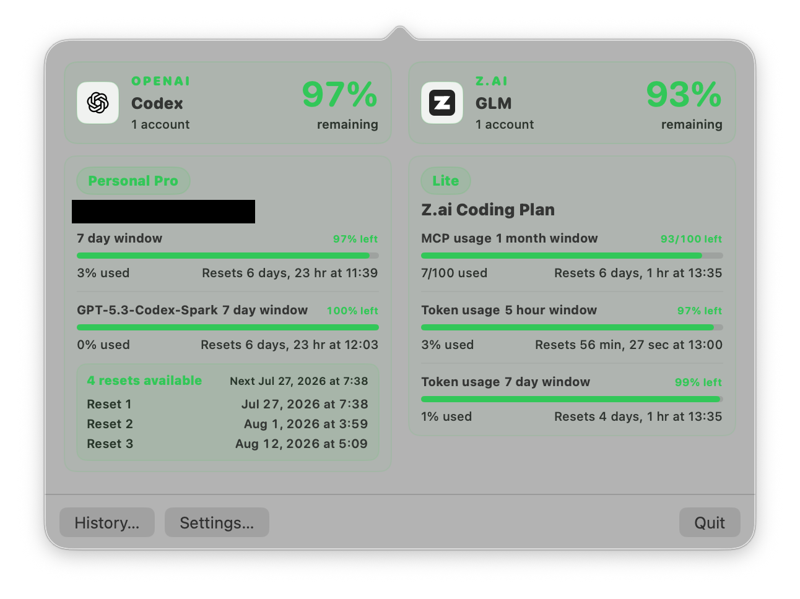
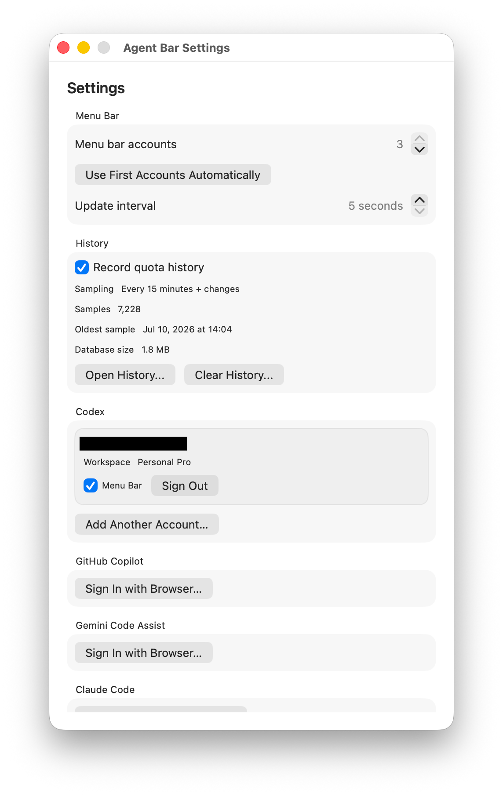

# AgentBar

AgentBar keeps coding-agent quota visible from the macOS menu bar or Windows system tray. See remaining quota, usage windows, reset times, and multiple accounts without opening each provider's dashboard.

[Download the latest release](https://github.com/lixiaocong/AgentBar/releases/latest)

## Preview

### Menu bar window

Click AgentBar in the menu bar to see every active quota window for the selected accounts. Providers stay in separate columns, and each account keeps its own plan and reset information.

### Settings

Settings lets you add or remove accounts, choose what appears in the menu bar, change the refresh interval, and manage quota history.

## Features

- Shows remaining quota, used quota, and reset times for every available usage window.
- Supports multiple accounts for the same provider.
- Displays dynamically returned model and plan quotas instead of a fixed list.
- Keeps up to three selected accounts visible in the macOS menu bar.
- Records local quota history on macOS so usage and resets are easy to review.
- Includes a configurable medium-sized macOS desktop widget for one account.

## Supported Services

| Service | What is shown | macOS | Windows |
| --- | --- | --- | --- |
| Codex | Usage windows, reset times, plan, and available reset credits | Yes | Yes |
| GitHub Copilot | Monthly quota and reset time | Yes | Yes |
| Gemini Code Assist | Dynamic per-model quotas and reset times | Yes | Yes |
| Claude Code | Session and weekly usage windows, per-model limits, reset times, and plan | Yes | Yes |
| Z.ai Coding Plan | Coding Plan quota windows and reset times | Yes | Not yet |
| Junie by JetBrains | Available monthly quota when provided by Junie | Yes | Yes |

## Install

### macOS

AgentBar requires macOS 14 or later.

1. Open the [latest release](https://github.com/lixiaocong/AgentBar/releases/latest).
2. Download `AgentBar-Mac.zip` and unzip it.
3. Move `AgentBar.app` to the Applications folder.
4. Open AgentBar. Its status appears on the right side of the menu bar.

AgentBar is a menu bar app, so it does not open a normal Dock window. If macOS asks for confirmation the first time, open the app from Finder using **Right-click > Open**.

### Windows

1. Open the [latest release](https://github.com/lixiaocong/AgentBar/releases/latest).
2. Download and run `AgentBar.exe`.
3. Use the AgentBar icon in the system tray to open usage or Settings.

## Add Accounts

Open **Settings...** from AgentBar:

- Use **Sign In with Browser...** for Codex, GitHub Copilot, Gemini Code Assist, and Claude Code.
- Use **Add Coding Plan...** for a Z.ai Coding Plan account on macOS.
- Use **Add Junie Token...** for Junie by JetBrains.

You can add more than one account, then choose which accounts are represented in the menu bar or system tray.

## Quota History on macOS

Choose **History...** from the AgentBar window to review quota changes over time. AgentBar records changes while it is running and keeps the history on this Mac until you clear it from Settings.

History recording is enabled by default. You can turn it off, remove older records, or clear all history at any time.

## Desktop Widget on macOS

1. Right-click the desktop and choose **Edit Widgets...**.
2. Search for **Agent Bar**.
3. Add the medium widget.
4. Edit the widget to choose the account it should display.

Open AgentBar at least once after installation so macOS can discover the widget and its accounts.

## Privacy

AgentBar keeps sign-in credentials in protected local system storage. Quota history also stays on the computer and is not synced or uploaded by AgentBar.
